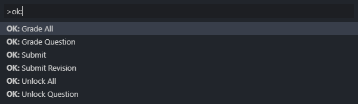

# vscode-okpy

Provides VS Code support for the [ok Python autograder](https://okpy.org)

## Extension Commands

This extension contributes the following commands:

### `okpy.question` - **OK: Grade Question**
Grade a specific question only

Equivalent shell command: `python3 ok -q <question>`
### `okpy.all` - **OK: Grade All**
Grade the entire assignment

Equivalent shell command: `python3 ok`

### `okpy.questionUnlock` - **OK: Unlock Question**
Unlock a question 
 
Equivalent shell command: `python3 ok -q <question> -u`
### `okpy.allUnlock` - **OK: Unlock All**
Unlock the entire assignment 
 
Equivalent shell command: `python3 ok -u`
### `okpy.submit` - **OK: Submit Assignment**
Submit the assignment 

Equivalent shell command: `python3 ok --submit`
### `okpy.revise` - **OK: Revise Assignment**
Submit a revision to an assignment 

Equivalent shell command: `python3 ok --revise`